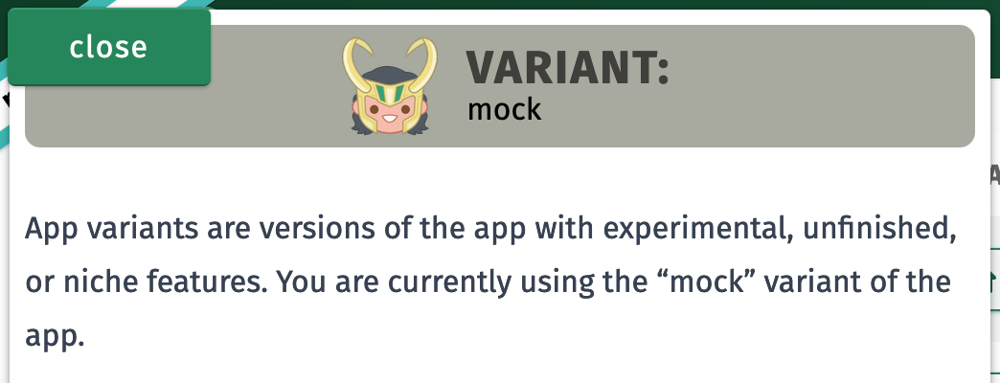

# App Variants: Feature branch builds (and more) for your statically-generated SPA

The split between front-end and back-end has been a double-edged sword ever
since the first developer chiseled JSX onto the wall of the tribal networking
cave. What had the curiosity of this ancient heretic wrought? Along with the
numerous advantages of client-rendered websites came numerous new challenges. We
started specializing to overcome these new challenges and explore this new way
of building for the web. Today, it is fairly typical for teams to be comprised
not of full stack developers, but of front-end developers and back-end
developers.

For better and worse, this is the timeline we are in, and it would be futile to
attempt to escape.


One casualty of the front-end/back-end divide is the dedicated feature branch
build. The place where your work-in-progress code can be deployed care-free as
you build so that you and your teammates can see a fully-integrated version of
your changes. But with teams, repositories, and deployments split along
technological lines, it can be difficult and time-consuming to find a way to
make feature branch builds work. And what if you serve your static front-end
assets via a simple, static file server?

At the possible expense of becoming another front-end heretic, I'll tell you
that you can trade _one more round trip to the server_ for completely isolated
front-end builds that are dynamically loaded without the need for special
back-end logic.

## Variants

Trying to achieve isolated feature branch builds solely through static,
front-end code led me to something even more versatile. This slight
architectural change allows you to deploy multiple builds of your application to
a single
[authority (sub-domain + domain + port)](https://developer.mozilla.org/en-US/docs/Learn/Common_questions/What_is_a_URL#authority),
with each build separated and loaded dynamically via a simple query parameter in
the URL.

The system allows you to dynamically load

- **Feature branch builds:** Our original goal. Deploy work-in-progress builds
  of your app as you develop a new feature.
- **Snapshots of previous versions of your application:** Perhaps you are
  working on rapidly changing data structures and you'll need to support the
  legacy versions of those structures for a time.
- **Builds for different environments:** Do some of your users need to connect
  to a different API?
- **Builds for different personas:** Maybe the marketing people at your company
  need to grab images of your new feature without any of the typical affordances
  rendered on screen.
- **Builds for different tasks:** Debugging in production can be easier when you
  are using the non-minified build and you've attached all your custom
  introspection UI tools.

All of these and more can coexist together on your file server, perfectly
separated and preserved. Since this system is more than just "versions" or
"feature branches", we've settled on a new name: Variants.

## The architectural shift

This entire article assumes you are working with a statically-generated,
SPA-like application. If you have more control over the server hosting your
static front end assets, perhaps another solution is possible, though this one
might still be better suited to your needs.

Additionally, if your deployment pipeline does not allow you to retain previous
build artifacts in production, you won't be able to use this approach.

### Typical static application loading

In a typical SPA-like website, your app is totally coupled to the `index.html`
file served at the root (and all other routes) of your site. It is responsible
for pulling in all the CSS and JS assets needed for the initial render of your
application. Your browser asks for the HTML file at some location on your site,
and the same exact file is always loaded, containing links to the same exact
assets every time. Once the site renders, perhaps your application recognizes
other assets that are required for your particular location and downloads those
as well, but by then your app is already running.

Every change to your application requires a brand new build of `index.html` to
reference multiple new CSS and JS files.


> CAPTION: (Diagrams created at https://play.d2lang.com)

### Variant loading

But what if the `index.html` file didn't contain references to any of the assets
needed to run your application? What if it loaded your application assets
dynamically, based on the variant of the application you request?

```yaml
# Loads the default variant
https://example.com

# Loads the `my_new_feature` variant
https://example.com?variant=my_new_feature
```

Instead of baking our application's static dependencies into the `index.html`
file, we can encapsulate the knowledge of those assets into a single JSON file,
and give that file an arbitrary (variant) name. Since we are now pushing the
knowledge of our assets into a file that must be loaded separately from the
index file, we have the opportunity to run a tiny bit of JavaScript in the
browser _before loading any application assets_. That tiny bit of JavaScript can
either load the default variant JSON of our application, or it can load any
arbitrary variant JSON file we request by name via a query parameter. Once that
JSON file is loaded, we can use it to gather our actual application
dependencies.

![Sequence diagram of modified "variant" SPA architecture page load https://play.d2lang.com/?script=rJPBTsMwDIbvfQo_wOg0jj0gMU5UE0xEcJqETGNGUOcEJx0gtHdHadZuYwz1wKlR8vnLH1vt21eAxNdnDygGOYCaX8LMoja8BEVvDXFFBXxlACqQg0laA7TvLMBvkUdtcCm4as-exL57kgKmaZEKSNZxT7XffQ7OLvrT8R4b93uVYU0f-UtY1S2BWpMGsQ1rCGJcF-tA2hfPUTyNQBqGNbKpa4RSjQBZL1gbX9l423rbgVLd3sD93ezY14U8Qf6Sekvmr95yS21-PvwwY4wEXaIFa3LEmrj6jNf4LNZ3kzj_z0lUlqtGhDiARI8PfizknWVP_qi3edh1Iw8FXCnV5dv5E9RXJOrZ1OT_lpVDXOUg1fUKlzTAlrid8PSQptYGQOdqU2H8ew4mMolomk22yb4DAAD__w%3D%3D&sketch=0&theme=104](./img/variant.png)

> CAPTION: The only change from the "typical SPA loading sequence" is the added
> round trip in step 1.

If your files are all properly fingerprinted --the name of the file contains a
hash that forces it to be unique based on its exact contents --then you can keep
all your old assets on your server and let your variant JSON files load
whichever assets are required. Since every single build of your app can live
side by side with each other, you can load whichever variant you want as long as
you know the name of a JSON file that points to the proper dependencies.

### Trade-offs

There are some downsides to this approach.

- Your users will be waiting for one more round trip to the file server before
  you app begins to boot.
- There is a fair amount of customization you'll add to your Webpack config. (I
  won't be showing how to achieve this same result with other build tools,
  though it can be done.)
- Typical turn-key static site hosts (Netlify, etc) will prune your old build
  files each time you deploy, and that is completely antithetical to this
  approach.
- The different variants of your app may start battling each other for
  multiversal dominance.

If you find yourself in a situation where you can accept the tradeoffs above,
there are plenty of situations where loading _any_ variant of your app via the
same exact `index.html` at the same location can be immensely useful. Using
variant deployment, you can

- make a feature available to a select few people for testing
- quickly revert to a previous build if you discover a bug
- solve CORS problems exactly one time; not for production _and_ feature
  branches
- load debugging tools directly into your bundle or load the non-production
  build against the production environment to track down a problem
- make snapshots of your application available in perpetuity for compatibility
  reasons
- serve a _completely different_ application for each variant

## Our variant system at Trilliant Health

There are any number of ways you can build your application to use variants, but
I'll walk you through some of the concrete decisions we've made so you can get
an idea of how you might want to do this yourself. Before we dig into some real
code, let's go over a few other ideas to layer on top of our current
understanding of the variant system.

### Problems with query params

You'll note that I've described variant loading as being driven by a query param
called `variant`. But storing this kind of information in a query param has some
drawbacks.

- It kind of stinks that the whole application must be aware of this
  constantly-present query param. Any individual pages that need to manipulate
  the query params would need some defensive code to avoid dropping this param.
- And what if one of our internal users shares a URL from their browser that
  happens to contain a variant name that is not supposed to be used widely?

We should probably remove the query param from the page as soon as the app is
loaded, since the only time we need the variant name is when we fetch our
initial assets.

But then, what if the user refreshes their browser? Well, the variant name is
gone, and they'll load the default variant of the app. Plus, the web
applications we build at Trilliant Health use Auth0 for authentication and so
must redirect to and from Auth0. On the way back, we'd have to include the
`variant` query param again, anyway.

We could solve these problems with Local Storage. Once the index page loads and
knows what variant to fetch, we can store the name of the variant in Local
Storage. On subsequent reloads, we can check for that Local Storage value and
use it if no `variant` exists in the query params. That solves our two problems
above and also keeps things working for Auth0, but it creates two more problems:

- Users would not be able to load multiple variants of the app at once in
  multiple tabs unless they were very careful not to refresh the page.
- We'd have no good way to get our users back on the default variant when they
  are done with the variant they were using. They might get unwittingly stuck on
  a variant that isn't getting updates.

Placing this kind of burden on our users is a no-go. Our apps should just work
without the need for them know the intimate details of how our variant system
behaves. So Local Storage is out. But Local Storage has a sibling called Session
Storage with the same API that basically solves all the problems above. Session
Storage behaves exactly like Local Storage except it is handled on a per-window
(and per-tab) basis. When your tab is closed, all the Session Storage _for that
tab_ is cleared.

So on page load, we store the variant in Session Storage, drop the query param,
load the app, and let the entire application remain blissfully unaware of the
entire variant system.

### Variant-level config

In order to take full advantage of the variant system -- with builds that are
always current but have useful variations in behavior --we will probably want to
store some configuration information inside the variants themselves. For
example, the actual URL for your API server should probably be configured
instead of discovered at runtime.

Since our Webpack config will already need to be generally aware of variants, we
also house some other values inside a variant config that we can replace using
the `WebpackDefinePlugin`. So in our applications, calls to our API server
resemble this:

```ts
fetch(`${API_BASE_URL}/some-endpoint`)
```

And we let Webpack do the work of replacing `API_BASE_URL` with
`"https://api.example.com"` or `"https://dev-api.example.com"` or whatever other
URL makes sense for the given variant. We don't need to maintain some kind of
runtime cross-reference for which variants talk to which server. It all goes
into the variant config itself and is sussed out at build time.

## "Give me the code"

Not everything you need will be included below, because this is some deeply
custom code. But you should be able to merge these examples with your code and
get things running.

We also are not going to tackle the actual deployment step in this article. At
Trilliant Health, we use Azure Blob Storage (ABS) to serve our apps. Our final
step in deployment is to upload all our files to ABS. Since our asset filenames
contain a unique hash, we just let it upload and overwrite files with
conflicting names. The end result is that our _new_ assets get uploaded with no
conflict, _old_ assets are rewritten with the same content, and
`{variantName}.json` files get updated to point to new build assets.

### index.html

This is a slightly simplified version of the `index.html` file we use for all
our SPAs at Trilliant Health.

```html
INCLUDE INDEX.HTML
```

The comments in the code should mostly speak for themselves.

You'll note that we decided to inform the user of the missing variant in case it
is unavailable, instead of just reloading on their behalf. Depending on the
kinds of differences between variants, just loading the default variant might be
too subtle for the user to realize something didn't work. So we display a very
simple message.


The structure above expects the server to house all the variant information in
the `/variants/` directory. That directory might look like this:

```
variants
├── mock.json
├── my_new_feature.json
└── public.json
```

But how do we build those files? This is where we need to customize our Webpack
configuration.

### webpack.config.ts

The code below will not work in your project unless you add loader rules to your
Webpack config. Additionally, you may not have things set up to use TypeScript
in your Webpack config, but the TypeScript in this code example is fairly
limited and easily removed.

```ts
INCLUDE WEBPACK.CONFIG.TS HERE
```

This configuration will build our app into the `build` folder or serve it up via
the dev server when running locally. Assuming you fill in the missing loaders
and such to fit your needs, the config above will allow you to start a dev
server or build via the following command.

```bash
# compile and start the dev server for the my_new_feature variant
webpack serve --env variantName=my_new_feature

# build the public variant
webpack --env variantName=public
```

When you build, you'll get something approximating the following folder output.

```
build
├── assets
│   ├── css
│   │   ├── main.2a70d927cdc35881336a.css
│   │   └── main.2a70d927cdc35881336a.css.map
│   ├── images
│   │   └── 71124d3ac27ba0a97f64.png
│   └── js
│       ├── main.dac8c08c71723ee316dc.js
│       └── main.dac8c08c71723ee316dc.js.map
├── index.html
└── variants
    └── public.json
```

If you make a change and build again, you'll get the exact same `index.html`,
but a different version of `public.json` and different asset files. The magic
happens when you push these files to your server and build a _different_
variant.

If we were to build the "mock" variant, the resulting build is similar.

```bash
webpack --env variantName=mock
```

```
build
├── assets
│   ├── css
│   │   ├── main.2a70d927cdc35881336a.css
│   │   └── main.2a70d927cdc35881336a.css.map
│   ├── images
│   │   └── 71124d3ac27ba0a97f64.png
│   └── js
│       ├── main.486ca92fcb722bcd7339.js
│       └── main.486ca92fcb722bcd7339.js.map
├── index.html
└── variants
    └── mock.json
```

You'll see that the CSS and images are the same, but the JavaScript files are
different and we have a different variant JSON file named `mock.json`. If you
upload these files to your server along side your previous uploaded files,
you'll get something like the following.

```
(server)
├── assets
│   ├── css
│   │   ├── main.2a70d927cdc35881336a.css
│   │   └── main.2a70d927cdc35881336a.css.map
│   ├── images
│   │   └── 71124d3ac27ba0a97f64.png
│   └── js
│       ├── main.486ca92fcb722bcd7339.js
│       ├── main.486ca92fcb722bcd7339.js.map
│       ├── main.dac8c08c71723ee316dc.js
│       └── main.dac8c08c71723ee316dc.js.map
├── index.html
└── variants
    ├── mock.json
    └── public.json
```

Now, visiting your site at `example.com` will serve up the `public` variant
using `main.dac8c[...].js` while visiting `example.com/?variant=mock` will serve
up the `mock` variant using `main.486ca[...].js`.

## Diverging even farther


I mentioned a few times above that the code here is similar to what we use at
Trilliant Health. There are tons of little features we've layered on top of our
variant system. We've layered in a CLI that builds and deploys multiple variants
at once, so that you can have several variants all based on the latest changes
in your main branch. We've added a way to cut and freeze versions of our
application to allow internal users to work with older versions of a tool that
depends highly on a rapidly changing data structure. We've deployed variants
that allowed our marketing department personnel to capture images of
[our Similarity Index™ tools](https://datalab.trillianthealth.com) unencumbered
by explanatory text. We've added descriptions to the internal variants and UI
elements in the actual app that can read and understand which variants are
available to give users a way to switch as needed.



> CAPTION: Had I just finished watching Marvel's Loki series when I created this
> system? Maybe. Does our internal UI lean into that origin? Maybe. Icon
> available at [Slackmojis.com](https://slackmojis.com).

The possibilities are vast and the latitude you can gain from using a system
like this is very freeing. (You know what else is freeing? _Not_ doing automatic
deployments when your PRs get merged to main. 😱 But that is a heretical rant
for another time.)

Everything in the code above is just a single implementation of the idea of app
variants. And "app variants" is just a name I slapped on "moving your app
dependency references out of `index.html` so they can be loaded later." Have you
ever seen anyone else use this technique before? I'd love to know.

In any case, if these ideas are useful to you, please run with them! Let me know
what works for you and what you needed to change.
